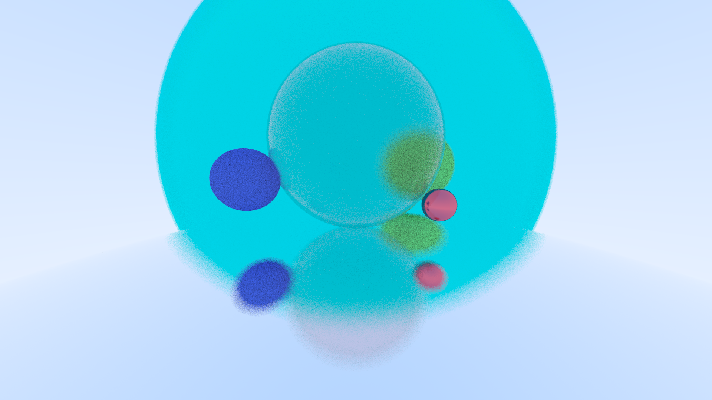
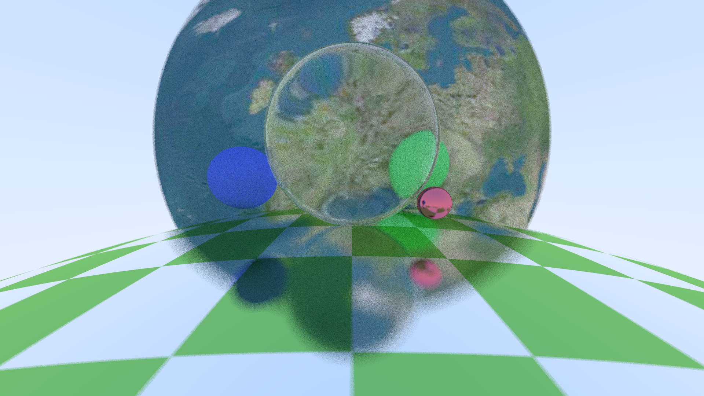

# RayTracing

A RayTracing project created by Liheng. The final target is to build a physical based renderer which can output a beautiful picture in a complicate scene. To be simple and straight, this project doesn't involve any graphic API like OpenGL or Vulcan. The basic idea is just sending some rays from every pixel and reach for a color return.

Here is some cool pictures generated by this code!

 

### The Basic function has complished:

* Path Tracker on Sphere Objects

* Lambertian Material

* Metal Material with fuzzy blur

* Dielectric Material including refraction and reflect

* Movable Camera with defocus blur

### Coming:

- [x] AABB

Axis-Aligned Bounding Boxes, This is a tree structure used to optimize on the intersection of rays and objects. However, when there are only few things inside the scene and they are overlaping on each other, AABB may lessen the efficiency... Anyway, we have that now!

*Also, something wired happens when it applys on the Dielectric Objects, it seems too many refraction and rays are bumping there. I have to expand the bounding box of these objects to make it looks normal. Anyway, I will fix that someday.*

- [x] Surface Textures

Now, we have a nice-looking texture system, which means all kinds of beautiful picture and textures can be attached to the spheres! We will support **bi-linearlarp & mipmap** every soon !

- [ ] Emitting Objects

- [ ] Triangles

- [ ] Parallelism (on CPU / GPU)

### Some important library:

*The greatest thing about these two library is that they are just some hpps, you can plug them in the code directly !*

**glm**

Yes, we use glm as our math library, so we don't have to rewrite vectors! (and the dot and the cross ...)

**stb_image**

we use this one to create the image! :)
