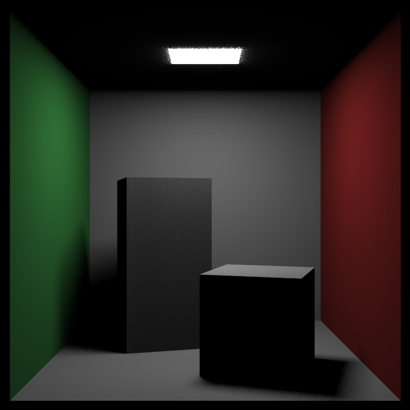

# RayTracing

A RayTracing project created by Liheng. The final target is to build a physical based renderer which can output a beautiful picture in a complicate scene. To be simple and straight, this project **DOES NOT** involve any graphic API like OpenGL or Vulcan. The basic idea is just sending some rays from every pixel and reach for a color return.

github : [GitHub - LihengW/RayTracing: A Raytracing Renderer which is able to create fancy pictures! Love these amazing techs!](https://github.com/LihengW/RayTracing)

Here is some cool pictures generated by this code!

***cornell box :***

### The Basic function has complished:

* Path Tracker on Sphere / Quads Objects

* Lambertian Material

* Metal Material with fuzzy blur

* Dielectric Material including refraction and reflect

* Movable Camera with defocus blur

### Recently Featured:

- [x] PDF Sampling

PDF(probability density function) has been implemented in the renderer. This function is like constent mask of probability which can decide the sampling direction and bias of sampling created in the process. The properly constructed PDF can sharply increase the speed of converge and improve performance. We have several examples below.

*LightPDF(only sample the rays towards light sources)*

*CosPDF(sample the rays according to the cosine of the normal like the Lambert)*

*MixedPDF(mixture of both of the pdf to get fine result)*

we can clearly see how much improvement the pdf brings to the performance especially in denoising. However, creating proper pdfs for kinds of objects and meterials is also a heavy work.

- [x] AABB

Axis-Aligned Bounding Boxes, This is a tree structure used to optimize on the intersection of rays and objects. However, when there are only few things inside the scene and they are overlaping on each other, AABB may lessen the efficiency... Anyway, we have that now!

*Also, something wired happens when it applys on the Dielectric Objects, it seems too many refraction and rays are bumping there. I have to expand the bounding box of these objects to make it looks normal. Anyway, I will fix that someday.*

- [x] Surface Textures

Now, we have a nice-looking texture system, which means all kinds of beautiful picture and textures can be attached to the spheres! We will support **bi-linearlarp & mipmap** every soon !

- [x] Emitting Objects

Light sources are extremely important parts in raytracing renderer, because we no longer need abstract light like point light or paralight. Every beam can be shot from a emitting surface(which is more realistic I think), use Emit Material to do that. Now, our light sources are physical objects!

- [x] Quadrilaterals & Transformation

Spheres are so boring that we see few spheres around our real life. Times for Quadrilaterals ! We support Quads in the renderer, and they can be used to construct oceans of cool objects. Furthermore, we have a large object class who contains multiple quads inside. 

The functions inside the box class can be used to move the object around and rotate them along x/y/z axis. We implement this fuction by change the ray in the reverse way. However, direct change on them vertex / quads coords like traditional graph pipeline is another option. We will consider that in the future.

- [x] Perlin Noise

Amazing noise feature is available in this renderer, use them to create great texture like marble surface, and even use them in the height map(on building). This noise has good feature that it gathers similar color and pattern in the nearby area.

### Coming:

- [ ] Parallelism (on CPU / GPU)
- [ ] Volumn Fog / Texture

### Some important library:

*The greatest thing about these two library is that they are just some hpps, we can plug them in the code directly !*

**glm**

Yes, we use glm as our math library, so we don't have to rewrite our vectors class! (and the dot fuction and the cross fuction...)

**stb_image**

we use this one to create the image! :)
