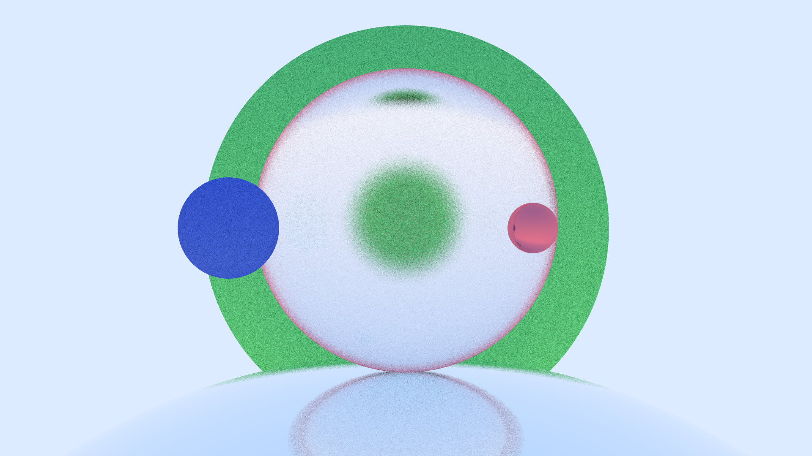

# RayTracing

A RayTracing project created by Liheng. The final target is to build a physical based renderer which can output a beautiful picture in a complicate scene. To be simple and straight, this project doesn't involve any graphic API like OpenGL or Vulcan. The basic idea is just sending some rays from every pixel and reach for a color return.

Here is some cool pictures generated by this code!

The function has complished:

* Path Tracker on Sphere Objects

* Lambertian Material

* Metal Material with fuzzy blur

* Dielectric Material including refraction and reflect

* Movable Camera with defocus blur

Coming:

- [ ] Emitting Objects

- [ ] Triangles

- [ ] Surface Texures

- [ ] Parallelism (on CPU / GPU)

Some important library:

*The greatest thing about these two library is that they are just some hpps, you can plug them in the code directly !*

**glm**

Yes, we use glm as our math library, so we don't have to rewrite vectors! (and the dot and the cross ...)

**stb_image**

we use this one to create the image! :)
